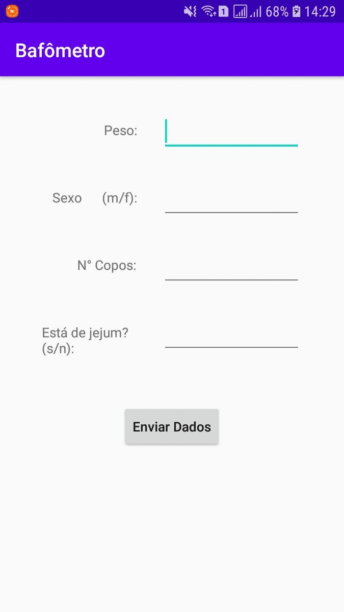

# :beer: BafometroCalculo v1.0
O Bafômetro (ou etilômetro) é um aparelho que permite determinar a
concentração de bebida alcóolica no organismo de uma pessoa analisando o ar
exalado dos pulmões. Este equipamento é utilizado por policiais para verificar o nível
de álcool etílico presente no ar expirado por motoristas.

A taxa de alcoolemia é a quantidade de álcool existente no sangue de um
indivíduo, em determinado momento, e se expressa em gramas de álcool por litro de
sangue (g/l). Assim, quando se fala de uma alcoolemia de 0,5 g/l é o mesmo que dizer
que existem 0,5 g de álcool por litro de sangue.

O valor máximo da taxa de alcoolemia permitido pelo código brasileiro de
trânsito até Janeiro de 2013 era de 0,2 g/l. Atualmente a taxa permitida é 0,0 g/l.

Esta aplicação é composta por dois apps, o primeiro solicita as informações para o cálculo
e o segundo realiza o cálculo e retorna os dados para o primeiro app.

+ [Bafômetro](https://github.com/DiegoTeixeira7/Bafometro.git)
+ [BafômetroCálculo](https://github.com/DiegoTeixeira7/BafometroCalculo.git)

## :computer: Tecnologias

Este projeto foi desenvolvido com as seguintes tecnologias:

-  [Java](https://www.java.com/pt-BR/)
-  [Android](https://developer.android.com/docs)
-  [Android Studio](https://developer.android.com/studio)

### :arrow_forward: Em Execução:

<p align="center">
 
</p>

### :information_source: Como usar:

Para clonar e executar este aplicativo, você precisará do Git e Android Studio instalados em seu computador. Na linha de comando:

```bash
# Clonar este repositório
$ git clone https://github.com/DiegoTeixeira7/BafometroCalculo.git

# Abra o projeto em seu Android Studio e execute

```

### :memo: Licença
Este projeto está sob a licença do MIT. Consulte a [LICENSE](https://github.com/DiegoTeixeira7/BafometroCalculo/blob/master/LICENSE) para obter mais informações.
